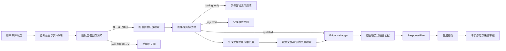

# GraphRAG 诊断多跳证据链接入设计

## 1. 背景

当前项目已经具备图谱候选路由、图谱诊断工具、手册检索、`EvidenceLedger` 和最终回答审核，但这些能力没有形成一条连续的生产证据链。

已有 100 题开发集消融运行表明：

- `graph` 变体完成了 99 次图候选查询，但图候选总数为 0；
- 100 题中只有 9 题实际调用图工具；
- 图谱组和无图组最终通过率分别为 58% 和 57%，差异不显著；
- 当前结果不能证明知识图谱优劣，因为图谱证据没有稳定进入回答。

代码审计确认存在四个直接断点：

1. `GraphCandidateVO -> KnowledgeCandidate -> RoutePlan.graph_scope` 只服务于路由和反问，不会写入回答证据账本。
2. Java 生产 `DiagnosisPathVO` 不返回 `pathId/nodeIds/provenance`，但 Python `EvidenceLedger` 只有收到 `pathIds` 或 `nodeIds` 才接收图谱记录，因此真实图工具结果会被跳过。
3. 当前相关单测人工构造了生产 DTO 不返回的 `pathIds/nodeIds`，没有覆盖真实接口契约。
4. 最终回答审计对“可直接支持回答的证据”仍以手册证据为核心，图谱证据不能稳定支持设备、部件、故障和方案等诊断事实。

对完整运行日志的复核进一步说明：99 次空候选中，约 92 次由外部向量服务域名解析失败直接造成，另外 7 次是按现有规则不适用于图候选的参数查询。Python 候选客户端默认 3 秒超时，而 Java 约 5 秒后才记录依赖失败，导致 Python 先超时并把异常吞成空结果。因此“候选为 0”同时混合了依赖故障、不适用和真实空结果。

## 2. 目标与边界

### 2.1 目标

为诊断类问题建立服务端受控、可追溯、可降级的双检索证据链：

```text
设备 -> 部件 -> 故障 -> 已沉淀解决方案
```

图谱路径必须在最终回答生成前自动检索、结构化校验并写入统一证据账本。手册检索继续提供检查方法、操作步骤、参数、安全要求和图片。

### 2.2 非目标

本次不让知识图谱承担以下职责：

- 拆装步骤和操作顺序；
- 扭矩、间隙、容量等精确参数；
- 安全注意事项；
- 手册图片和页码召回；
- 普通清单、参数和流程题的强制图检索；
- 案例库和流程推荐能力的效果归因。

### 2.3 核心原则

- 图谱负责关系和诊断假设，手册负责可执行操作。
- 路由候选不是回答证据，必须经过证据检索与资格校验。
- 是否调用图谱由服务端策略决定，不依赖 LLM 自主选工具。
- 检索失败、图谱为空和候选被过滤是三个不同状态，不能统一伪装成空结果。
- 没有稳定来源标识的图记录只能用于路由，不能支持最终事实。
- 任何图谱作用域过滤为空时必须失败关闭，不得自动放宽为全图查询。

## 3. 推荐架构

采用“受控双检索 + 统一证据账本”架构。



新的核心边界如下：

| 组件 | 职责 | 不负责 |
|---|---|---|
| `GraphCandidateProvider` | 召回可供消歧的图路径范围 | 支持最终回答事实 |
| `GraphEvidenceRetriever` | 使用服务器作用域检索完整诊断路径 | 生成自然语言答案 |
| `GraphEvidenceQualifier` | 校验身份、关系、方案状态和来源 | 放宽检索范围 |
| `EvidenceLedger` | 保存不可变、稳定的手册/图谱证据 | 判断问题是否已完整回答 |
| `EvidenceFusionService` | 将回答要点绑定到允许的证据类型 | 直接执行检索 |
| `ResponsePlan` | 规定允许回答、缺失和冲突内容 | 将路由候选升级为证据 |

## 4. 触发策略

图谱证据链只在以下条件同时满足时自动执行：

- `RAG_VARIANT` 为 `graph`，或完成验证后启用新链路的 `production`；
- 意图属于故障诊断或 `task_action=find_cause`；
- 查询中存在症状、故障描述、部件或设备线索之一；
- 当前请求不是纯参数、纯清单或纯拆装流程查询。

`no_graph` 变体必须跳过候选查询、证据检索、图谱审核和所有 `/weixiu/path/*` 请求。

`graph` 变体不能依赖 LLM 是否选择 `java_graph_diagnosis_path`。服务端在调用 Agent 前完成图证据检索，并把合格图证据放入请求级上下文和 `EvidenceLedger`。原有图工具可以保留为生产兼容入口，但必须复用同一个 `GraphEvidenceRetriever`，不得形成第二套证据转换逻辑。

## 5. Java 图谱返回契约

### 5.1 扩展诊断路径 DTO

扩展 `DiagnosisPathVO`，至少返回以下字段：

```text
pathId
nodeIds
relationshipTypes
deviceId / deviceName
componentId / componentName
faultId / faultName / faultSeverity
solutionId / solutionTitle
solutions[].id/title/status/verified/kind
documentId
documentVersion
sectionId
sourceChunkUids
pages
graphRevision
provenanceStatus
matchScore
```

约束：

- `pathId` 必须由业务节点 ID 生成，禁止使用 Neo4j 内部 element ID。
- 推荐稳定形式为 `kgpath:{deviceId}:{componentId}:{faultId}`；方案作为路径下证据项，不影响主路径身份。
- `nodeIds` 至少包含设备、部件和故障业务 ID。
- `relationshipTypes` 至少包含实际返回路径中的关系类型，例如 `OWNS`、`HAS_FAULT`、`HAS_SOLUTION`。
- `sourceChunkUids`、文档、章节和页码来自建图时保存的真实来源，不允许在查询阶段推测。
- `graphRevision` 标识建图数据版本，便于实验复现和缓存失效。

### 5.2 检索状态包络

`/weixiu/path/candidates` 和 `/weixiu/path/search` 必须明确返回：

```json
{
  "retrievalStatus": "found | empty | not_applicable | degraded | unavailable | filtered_out",
  "reason": "machine_readable_reason",
  "records": [],
  "diagnostics": {
    "exactRecallCount": 0,
    "lexicalRecallCount": 0,
    "vectorRecallCount": 0,
    "vectorAvailable": true,
    "filteredCount": 0
  }
}
```

状态语义：

- `found`：至少存在一个满足作用域的记录；
- `empty`：查询成功，但图谱确实没有匹配记录；
- `not_applicable`：当前问题不属于诊断多跳适用范围，例如纯参数或清单查询；
- `degraded`：部分依赖不可用，但精确或词法召回仍返回了可校验记录；
- `unavailable`：依赖、鉴权、网络或查询执行失败；
- `filtered_out`：存在初始候选，但全部不满足服务器作用域。

Python 不得再把异常吞掉后返回与 `empty` 相同的空元组。

### 5.3 候选召回策略

候选召回按以下顺序融合：

1. 服务器 allow-list 中的业务 ID 精确命中；
2. 设备、部件和故障名称的词法命中；
3. 文本或多模态向量命中；
4. 对融合结果执行不可放宽的 allow-list 过滤；
5. 去重并按可解释分数排序。

外部 Embedding 不可用时，精确和词法召回仍可工作，同时返回 `vectorAvailable=false`。如果所有召回方式均不可执行，状态必须是 `unavailable`，而不是 `empty`。

客户端总超时必须大于 Java 服务端各阶段预算之和，并为连接、Embedding、Neo4j 查询分别记录耗时。服务端应主动在预算内返回结构化状态，不能依赖客户端先行超时。

### 5.4 来源建模

Component、Fault 和 Solution 可能来自多个文档、章节和 Chunk，不能继续使用容易被后续 MERGE 覆盖的单值 `document_id/section_id/source_chunk_uid` 作为唯一来源。

推荐将来源建成独立 `EvidenceSource` 节点或带属性的来源关系：

```text
(Component|Fault|Solution)-[:SUPPORTED_BY]->(EvidenceSource)
EvidenceSource {
  documentId,
  documentVersion,
  sectionId,
  sourceChunkUid,
  page,
  sourceType,
  extractionRevision
}
```

查询返回路径时分别聚合每个事实的来源，不得使用 `coalesce(component.document_id, device.document_id, fault.document_id)` 给整条路径指定一个可能错误的来源。迁移完成前，多值来源字段至少必须采用并集合并，不能覆盖已有来源。

## 6. Python 图谱证据模型

新增结构化 `GraphEvidence`，不直接把 Java 字典或格式化文本交给最终回答层：

```text
evidence_id          = graph:{pathId}:{solutionId-or-none}
source_type          = graph
qualification        = qualified | routing_only | rejected
path_id
node_ids
relationship_types
device
component
fault
solution
confidence
graph_revision
provenance_status
source.document_id
source.document_version
source.section_id
source.source_chunk_uids
source.pages
rejection_reasons
```

`evidence_id` 在相同图谱 revision 下必须稳定。所有字段经统一 Normalizer 处理后才能写入 `EvidenceLedger`。

### 6.1 资格规则

一条路径成为 `qualified` 必须满足：

- `pathId` 非空；
- 设备、部件、故障业务 ID 和名称完整；
- `nodeIds` 包含路径上的核心节点；
- `relationshipTypes` 能证明设备、部件、故障之间的实际关系；
- `provenanceStatus=complete`；
- 匹配分数达到预注册阈值；
- 若支持“处理方案”事实，方案必须为 `status=active` 且 `verified=true`。

以下记录只能成为 `routing_only`：

- 只有设备和部件骨架，没有故障；
- 有图节点，但没有完整来源或稳定路径 ID；
- 方案未验证或已经过期；
- 匹配分数低于回答阈值但高于路由阈值。

接口异常、跨设备污染、allow-list 不匹配、关系缺失或字段矛盾的记录为 `rejected`。

## 7. 双检索数据流

### 7.1 图谱阶段

1. 解析用户查询得到设备、部件、症状和工况。
2. 候选 Provider 返回候选和检索状态。
3. 高风险且存在多设备/多部件歧义时发起结构化反问。
4. 唯一候选或用户确认后生成服务器拥有的 `graph_scope`。
5. `GraphEvidenceRetriever` 使用 `graph_scope` 调用 Java 路径检索，并强制注入 `allowedPathIds/allowedDeviceIds/allowedComponentIds/allowedFaultIds`；LLM 不能覆盖这些字段。
6. `GraphEvidenceQualifier` 把结果分成 `qualified/routing_only/rejected`。
7. 只有 `qualified` 记录写入最终证据账本；`routing_only` 只能用于下一步检索扩展。

### 7.2 手册阶段

使用图路径中的设备、部件、故障和方案名称生成受控检索扩展，但必须保持用户原问题为主查询。检索仍受以下范围限制：

- 已确认的 `documentId`；
- 合格来源给出的 `sectionId/sourceChunkUids`；
- 当前设备和文档版本；
- 不可跨设备自动借用步骤或参数。

手册召回结果继续通过现有 Qualification、EvidenceBundle 和文档隔离门禁。

## 8. 按回答要点融合证据

新增 `EvidenceFusionService`，把问题拆成回答要点，并按照来源权限绑定证据：

| 回答要点 | 图谱可支持 | 手册可支持 | 最低要求 |
|---|---:|---:|---|
| 设备身份 | 是 | 是 | 至少一个合格来源且无冲突 |
| 部件归属 | 是 | 是 | 稳定关系路径或明确手册内容 |
| 可能故障 | 是 | 是 | GraphRAG 模式优先要求合格图路径 |
| 故障与部件关系 | 是 | 有明确文本时可以 | 关系类型必须存在 |
| 处理方向 | 已验证方案可以 | 是 | 至少一个合格来源 |
| 检查方法 | 否 | 是 | 必须有手册证据 |
| 拆装步骤 | 否 | 是 | 必须有手册证据和顺序 |
| 参数/扭矩/容量 | 否 | 是 | 必须有手册表格或正文 |
| 安全要求 | 否 | 是 | 必须有手册或已审核规则 |

融合后的 `aspect_support` 必须引用真实 `evidence_id`，不能仅设置布尔值。

`ResponsePlan.allowed_evidence` 同时允许 `manual`、`graph` 和 `domain_rule`，但生成与审核时按上表限制每种证据能够支持的声明类型。现有“只要有合格手册证据就允许回答”的判断需改成“当前回答要点存在被授权来源支持的证据”。

`EvidenceLedger` 应消费统一 Normalizer 产出的结构化证据，不再从多种原始 DTO 中猜测字段。ReAct `call_record.evidence` 如果保留，必须与预检索路径复用同一 Normalizer 并由 Ledger 实际消费；不能继续作为无人读取的 Trace 字段。

## 9. 最终回答规则

诊断回答推荐结构：

```text
可能相关故障
- 图谱路径支持的设备、部件和故障关系

手册检查方法
- 手册支持的检查位置、步骤和参数

处理建议
- 仅输出已验证图方案或手册明确步骤

依据
- 知识图谱路径标识（放在 metadata，界面可按需展示）
- 手册名称、章节和页码
```

规则：

- 图谱仅命中设备/部件骨架时，不得输出故障结论。
- 图谱有故障路径、手册无操作依据时，可以说明“图谱关联到某故障”，但不能补写检查步骤和参数。
- 手册有故障说明、图谱为空时，按普通 RAG 回答，并记录本题没有图谱贡献。
- 两类证据冲突时，不自动选边；展示冲突来源并要求确认设备或版本。
- 最终回答的图谱事实必须能回溯到 `pathId/nodeIds/relationshipTypes`。
- ReviewAgent 必须审核结构化 `result_data` 和最终允许的 `evidence_id`，不得再解析被截断的 200 字符摘要，也不得用“故障节点存在且方案节点存在”替代真实路径关系校验。

## 10. 失败与降级

| 情况 | 行为 |
|---|---|
| 图谱 `empty` | 继续手册 RAG，记录 `graph_evidence_status=empty` |
| 图谱 `unavailable` | 继续手册 RAG，记录故障原因和降级，不声称图谱无数据 |
| 图谱 `filtered_out` | 不放宽范围；必要时反问设备/部件 |
| 图谱低置信度 | 仅用于路由，不支持最终事实 |
| 图谱多候选高风险 | 结构化反问，不按最高分猜测 |
| 手册为空但图路径合格 | 只回答关系和已验证方案，不输出操作参数 |
| 图谱与手册冲突 | 进入 `conflict`，列出两类来源 |
| no_graph 访问图接口 | 标记实验完整性失败 |

## 11. 可观测性与实验字段

每个请求至少记录：

```text
rag_variant
graph_applicable
graph_candidate_status
graph_candidate_query_count
graph_candidate_count
graph_path_query_count
graph_path_record_count
graph_evidence_qualified_count
graph_evidence_routing_only_count
graph_evidence_rejected_count
graph_evidence_used_ids
graph_retrieval_reason
graph_embedding_status
graph_timeout_stage
graph_revision
graph_latency_ms
manual_evidence_used_ids
claim_evidence_bindings
variant_integrity_pass
```

`graph_tool_call_count` 不能再作为“图谱参与回答”的代理指标。正式指标应是 `graph_evidence_qualified_count` 和 `graph_evidence_used_ids`。

## 12. 文件边界

Java 侧主要修改：

- `weixiu/.../pojo/vo/DiagnosisPathVO.java`
- `weixiu/.../pojo/vo/DiagnosisSearchVO.java`
- `weixiu/.../pojo/vo/GraphCandidateVO.java`
- 新增 `GraphCandidateSearchVO.java` 或等价包络 DTO
- `weixiu/.../service/impl/GraphQueryServiceImpl.java`
- 对应 Controller 契约测试和 Service 测试

Python 侧主要修改：

- 新增 `FixAgent/services/retrieval/graph_evidence.py`
- 新增 `FixAgent/services/retrieval/evidence_fusion.py`
- 扩展 `FixAgent/services/retrieval/evidence.py`
- 扩展 `FixAgent/services/retrieval/response_plan.py`
- 扩展 `FixAgent/services/routing/graph_candidate_provider.py`
- 在 `FixAgent/api/main.py` 只保留编排和 metadata 汇总，不继续堆积资格判断
- `FixAgent/tools/graph_java_tool.py` 复用新的 Retriever/Normalizer

## 13. 测试策略

实现遵循先失败测试、再修改生产代码。

### 13.1 Java 契约测试

- 真实 `/search` JSON 必须包含稳定 `pathId/nodeIds/relationshipTypes`。
- `pathId` 不依赖 Neo4j 内部 ID。
- Embedding 不可用时精确/词法召回仍工作，或明确返回 `unavailable`。
- allow-list 过滤后为空返回 `filtered_out`，不得自动宽搜。
- 图记录返回真实文档、章节和 source chunk 来源。
- 只有 active、verified 方案能够标记为回答级证据。

### 13.2 Python 单元测试

- 使用生产 DTO fixture 验证 `EvidenceLedger` 能接收图路径。
- 缺少 path/node/relationship/provenance 的记录不能成为 qualified。
- 路由候选不会自动成为回答证据。
- 图谱 `unavailable` 与 `empty` 不会混淆。
- `not_applicable` 参数题不会被统计为图候选召回失败。
- 图谱证据不能支持扭矩、步骤和安全要求。
- 手册与图谱证据能共同覆盖不同回答要点。
- 图谱与手册冲突进入 conflict。
- `no_graph` 的所有图调用和图证据计数为 0。

### 13.3 端到端测试

至少准备以下构造探针：

1. 唯一设备的多跳诊断题：必须自动得到 qualified 图证据。
2. 多设备同名部件题：必须反问，不得猜测。
3. 图谱有路径、手册有步骤题：两种证据同时进入账本。
4. 图谱有路径、手册无步骤题：只输出诊断关系，不补写操作。
5. 图谱不可用题：普通 RAG 正常降级且审计状态正确。
6. no_graph 同题：不得发生任何图 HTTP 调用。

## 14. 验收门槛

在重新运行正式消融前必须全部满足：

- 生产 DTO 与 Python fixture 契约一致；
- 图依赖诊断开发集的候选覆盖率不低于 80%；
- 图接口成功率不低于 95%；
- 客户端超时大于服务端预算，图候选请求超时率低于 1%；
- 图依赖题 qualified 图证据覆盖率不低于 70%；
- 所有已使用图证据都能回溯到稳定 path/node/relationship ID；
- 图谱证据支持参数或步骤的越权率为 0；
- `no_graph` 图候选、图路径、图审核和图 HTTP 调用全部为 0；
- 图谱不可用时普通 RAG 降级成功率为 100%；
- 两组实验除 `RAG_VARIANT` 外的模型、语料、索引和参数保持一致。

达到上述机制门槛后，先运行 20 至 30 道图谱诊断开发题，再运行现有 100 题回归集。最终答辩结论仍需使用冻结盲测集和重复运行结果。

## 15. 推进顺序

1. 修复 Java DTO 和检索状态契约，先让图查询结果可追溯。
2. 修复候选召回为 0，以及异常被伪装成空结果的问题。
3. 实现 Python `GraphEvidence` Normalizer 和资格校验。
4. 让服务端在诊断问题上自动执行图路径检索。
5. 实现图谱与手册的回答要点级融合。
6. 扩展最终回答审核和可观测字段。
7. 通过构造探针和机制门槛后，再执行消融测评。

生产 `RAG_VARIANT=production` 在机制门槛通过前保持现状；新链路先仅在 `graph` 实验变体启用，验证通过后再切换生产默认行为。
